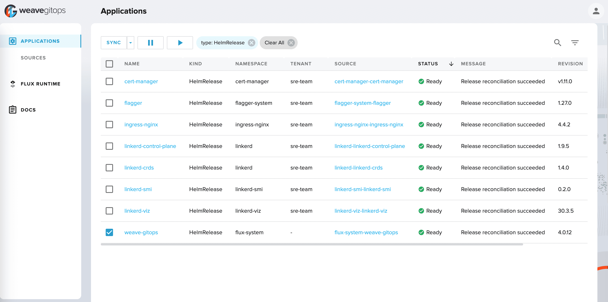
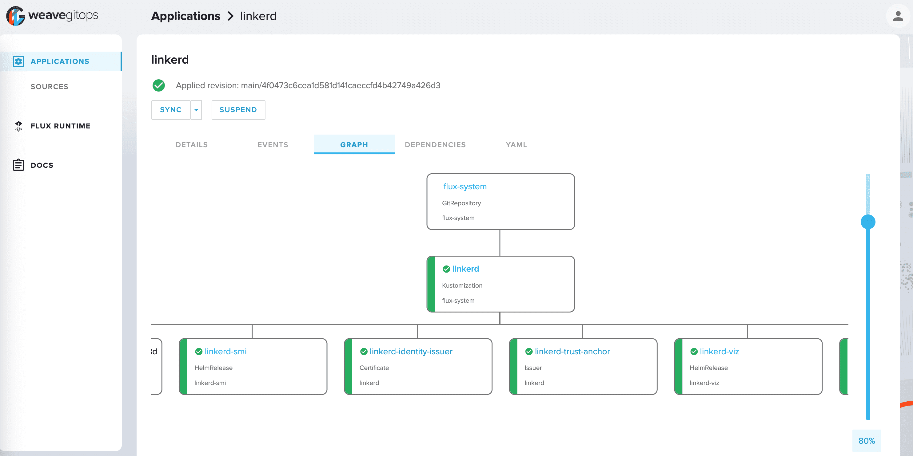
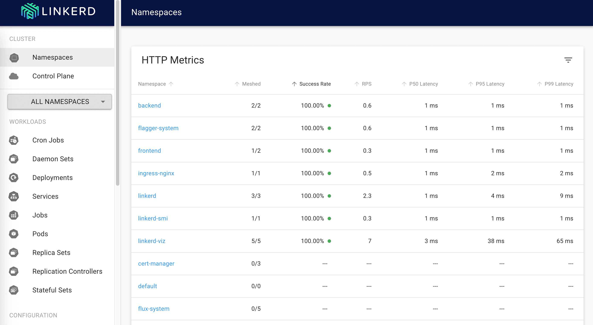

# gitops-linkerd

[](https://github.com/stefanprodan/gitops-linkerd/actions)
[](https://github.com/stefanprodan/gitops-linkerd/blob/main/LICENSE)

Progressive Delivery workshop with [Linkerd](https://github.com/linkerd/linkerd2),
[Flagger](https://github.com/fluxcd/flagger), [Flux](https://github.com/fluxcd/flux)
and [Weave GitOps](https://github.com/weaveworks/weave-gitops).



## Introduction

### What is GitOps?

GitOps is a way to do Continuous Delivery, it works by using Git as a source of truth
for declarative infrastructure and workloads.
For Kubernetes this means using `git push` instead of `kubectl apply/delete` or `helm install/upgrade`.

In this workshop you'll be using GitHub to host the config repository and [Flux](https://fluxcd.io)
as the GitOps delivery solution.

### What is Progressive Delivery?

Progressive delivery is an umbrella term for advanced deployment patterns like canaries, feature flags and A/B testing.
Progressive delivery techniques are used to reduce the risk of introducing a new software version in production
by giving app developers and SRE teams a fine-grained control over the blast radius.

In this workshop you'll be using [Flagger](https://flagger.app), [Linkerd](https://github.com/linkerd/linkerd2) and
Prometheus to automate Canary Releases and A/B Testing for your applications.

## Prerequisites

For this workshop you will need a GitHub account and a Kubernetes cluster version 1.21
or newer with **Load Balancer** support.

Steps for using a local Kind cluster are [included](#create-kind-cluster) in this document.

In order to follow the guide you'll need a GitHub account and a
[personal access token](https://help.github.com/en/github/authenticating-to-github/creating-a-personal-access-token-for-the-command-line)
that can create repositories (check all permissions under `repo`).

### Fork the repository

Start by forking the [gitops-linkerd](https://github.com/rparmer/gitops-linkerd)
repository on your own GitHub account.
Then generate a GitHub
[personal access token](https://help.github.com/en/github/authenticating-to-github/creating-a-personal-access-token-for-the-command-line)
that can create repositories (check all permissions under `repo`),
and export your GitHub token, username and repo name as environment variables:

```sh
export GITHUB_TOKEN=<your-token>
export GITHUB_USER=<your-username>
export GITHUB_REPO="gitops-linkerd"
```

Next clone your repository locally with:

```shell
git clone https://github.com/${GITHUB_USER}/${GITHUB_REPO}.git
cd ${GITHUB_REPO}
```

### Install CLI tools

Install flux, kubectl, linkerd, step and other CLI tools with Homebrew:

```shell
brew bundle
```

The complete list of tools can be found in the `Brewfile`.

## Create Kind cluster (optional)

Everything in this demo can be ran locally in a [Kind](https://kind.sigs.k8s.io/) cluster and a configuration file is included will automatically expose the nginx controller to the localhost.  This will prevent the need for port-forwarding later on.  To create a new cluster run:

```shell
kind create cluster --name gitops-linkerd --config kind/kind-config.yaml
```

## Cluster bootstrap

With the `flux bootstrap` command you can install Flux on a Kubernetes cluster and configure
it to manage itself from a Git repository. If the Flux components are present on the cluster,
the bootstrap command will perform an upgrade if needed.

```shell
flux bootstrap github \
  --owner=${GITHUB_USER} \
  --repository=${GITHUB_REPO} \
  --branch=main \
  --path=./clusters/my-cluster \
  --personal
```

When Flux has access to your repository it will do the following:

* installs the Flux UI (Weave GitOps OSS)
* installs cert-manager and generates the Linkerd trust anchor certificate
* installs Linkerd  using the `linkerd-crds`, `linkerd-control-plane`, `linkerd-viz` and `linkerd-smi` Helm charts
* waits for the Linkerd control plane to be ready
* installs the Kubernetes NGINX ingress in the `ingress-nginx` namespace
* installs Flagger and configures its load testing service inside the `flagger-system` namespace
* waits for NGINX and Flagger to be ready
* creates the faces deployments and configures it for progressive traffic shifting
* creates the faces-gui deployment and configures it for A/B testing


Watch Flux installing Linkerd first, then the demo apps:

```bash
flux get kustomizations --watch
```

When bootstrapping a cluster with Linkerd, it is important to control the installation order.
For the applications pods to be injected with Linkerd proxy,
the Linkerd control plane must be up and running before the apps.
For the ingress controller to forward traffic to the apps, NGINX must be injected with the Linker sidecar.

## Access the dashboards

All of the dashboards have been exposed ingresses and are accessable via various `sslip.io` urls.  You will need external-ip address for the `ingress-nginx-controller` service.  To find this run:

```sh
kubectl -n ingress-nginx get svc ingress-nginx-controller
```

If you are using the kind and create the cluster using the kind-config.yaml file provided, you can use the local `127.0.0.1` ip.

If no external-ip is listed and you are not using the provided kind-config, you will need to start port forwarding and you will use the local `127.0.0.1` ip:

```sh
kubectl -n ingress-nginx port-forward svc/ingress-nginx-controller 8080:80 &
```
> NOTE: You will need add the `8080` or the specified forwarding port to all dashboard urls

### Dashboard links

| Dashboard | Url | Credentials |
| --------- | --- | ----------- |
| Weave GitOps (Flux) | http://127-0-0-1.wego.sslip.io | username: `admin` password `flux` |
| Linkerd | http://127-0-0-1.linkerd.sslip.io | n/a |
| Faces | http://127-0-0-1.faces.sslip.io | n/a |

> replace `127-0-0-1` with the ip address of the ingress controller if necessary.  Also replace the `.` with `-` (ie change `127.0.0.1` to `127-0-0-1`)

Sample Flux ui


Sample Linkerd ui

