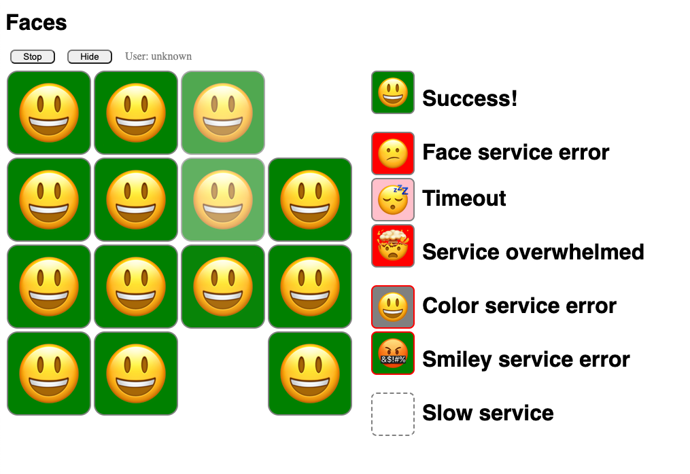

# Gitops Linkerd Workshop
This contains the steps required to complete the Flagger/Linkerd workshop.  Please make sure to review the [README](README.md) doc before starting this workshop.

## Getting started
This workshop will contain a lot of contact switching.  It is recommended to use multi browsers and terminals to help view changes as they progress through the various stages.  Installing a browser extention such as [ModHeader](https://modheader.com/) is also recommended.  This will allow use to modify request headers in the browser and view canary rollout progress in realtime.

### Verify deployments
The first thing we need to do is verify all the provided deployments are working correctly and accessable.  Navigate to each of the deployment links below and verify they all load correct:

Weave Gitops - http://127-0-0-1.wego.sslip.io (username: `admin` password: `flux`)

Linkerd - http://127-0-0-0.linkerd.sslip.io

Faces - http://127-0-0-1.faces.sslip.io

The faces deployment should be showing all green smiles that fade in and out.  


## Workshop
### Create failing canary release
Rather then show off a successful deployment first, lets start of by showing a failed deployment.

Update the ERROR_FRACTION value on line #36 in the [faces-sync.yaml](apps/faces/faces-sync.yaml) file to be "75"
```yaml
- patch: |
    - op: replace
        path: /spec/template/spec/containers/0/env/1
        value:
        name: ERROR_FRACTION
        value: "75"
  target:
  kind: Deployment
```

Commit, push and reconcile the change to trigger a new rollout
```shell
git add apps/faces/faces-sync.yaml
git push
flux reconcile ks apps --with-source
```

Don't worry about the resource not ready error.  That is due to the Flux dependsOn config and is normal when manually triggering a reconcile.
> We are only manually reconciling for demo purposes.  You do not need to do this in a production setting

Watch the canary progression
```shell
kubectl -n faces get canaries -w
```

You should see the `color`, `face`, and `smiley` canaries start progressing.  In the Linkerd dashboard you should see traffic being routed to the new deployments.  In the Faces dashboard you should start seeing error faces.  The canaries should progress for a few interations, then the progression should pause, and then the rollout should fail.  The Faces dashboard should return to all green faces and Linkerd should stop routing traffic to the new deployments.

The rollout failed because in our [faces-canary.yaml](/apps/faces/faces-canary.yaml) file we configured an acceptable failure percentage to be 70
```yaml
metrics:
  - name: request-success-rate
    thresholdRange:
      min: 70
    interval: 1m
```

### Create successful canary release
Lets update the ERROR_FRACTION to be at a lower level that is in the canaries acceptable range.  Update the ERROR_FRACTION value on line #36 in the [faces-sync.yaml](apps/faces/faces-sync.yaml) file to be "15"
```yaml
- patch: |
    - op: replace
        path: /spec/template/spec/containers/0/env/1
        value:
        name: ERROR_FRACTION
        value: "15"
  target:
  kind: Deployment
```

Repeat the commit, push and reconcile steps from earlier and watch the canary progession again.

You should see the same routing and dashboard changes again, but this time the progession should not pause.  The `weight` should continue until it reaches 50 (our configured `maxWeight` in the canary definition) before the rollout finishes and all traffic is routed to the new deployment.
